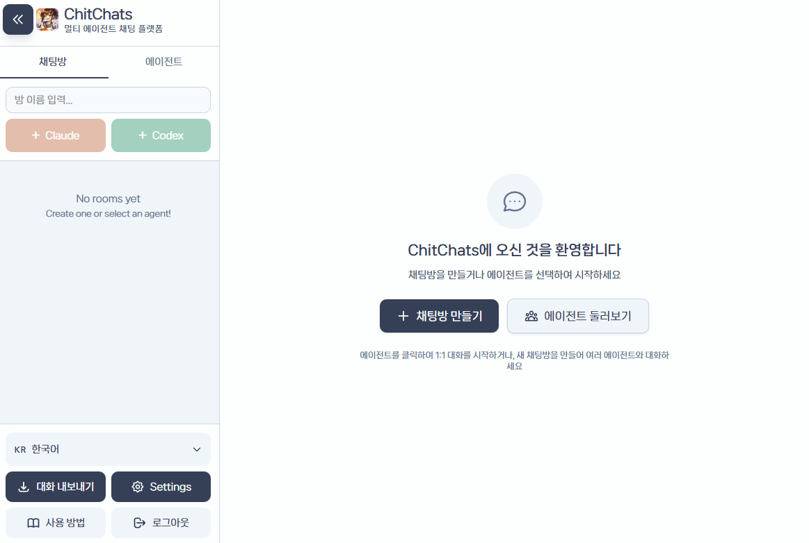

**🌐 Language: [한국어](README.md) | English**

# ChitChats

A real-time multi-agent chat application where multiple AI personalities interact in shared rooms. Supports multiple AI providers (Claude and Codex).

ChitChats is an interface for character chat that runs on *your own Claude or ChatGPT subscription*. No data is ever sent to the author's servers.



## Features

- **Multi-agent conversations** - Multiple AI agents with distinct personalities chat together
- **Multi-provider support** - Choose between Claude or Codex when creating rooms
- **Real-time streaming** - Token-by-token updates over Server-Sent Events (SSE), with polling as a fallback
- **Agent customization** - Configure personalities via markdown files with profile pictures
- **1-on-1 direct chats** - Private conversations with individual agents
- **Extended thinking** - View agent reasoning process (up to 32K thinking tokens)
- **Voice (TTS)** - Optional voice server reads agent lines aloud (`make dev-voice`)
- **Conversation exports** - Download conversation transcripts
- **JWT Authentication** - Secure password-based authentication with token expiration and rate limiting

## Tech Stack

**Backend:** FastAPI, SQLAlchemy (async), PostgreSQL, Multi-provider AI (Claude Agent SDK, Codex MCP)
**Frontend:** React, TypeScript, Vite, Tailwind CSS

## Prerequisites (Windows)

To use on Windows, you need to install at least one of the following:

- **Claude Code** - Install from [claude.ai/code](https://claude.ai/code)
- **Codex** - Download Windows version from [GitHub Releases](https://github.com/openai/codex/releases)

You can select the installed provider when creating a room.

## Install

### Windows

Run this in PowerShell. It installs `ChitChats.exe` plus the default agents from the
latest release into `%LOCALAPPDATA%\ChitChats` and creates Start Menu / Desktop shortcuts.

```powershell
irm https://github.com/sorryhyun/chitchats-public/releases/latest/download/install.ps1 | iex
```

To pass options, download the script first:

```powershell
irm https://github.com/sorryhyun/chitchats-public/releases/latest/download/install.ps1 -OutFile install.ps1
.\install.ps1 -InstallDir D:\ChitChats
```

Launch **ChitChats** from the Start Menu; it asks for a password on first run and opens your browser.

### macOS / Linux / WSL

```bash
curl -fsSL https://github.com/sorryhyun/chitchats-public/releases/latest/download/install.sh | bash
```

This installs the latest release into `~/.chitchats`, installs dependencies, walks you through
creating `.env` (password prompt), and drops a `chitchats` launcher in `~/.local/bin`.
**Node.js 20+** is required; `uv` is installed automatically if missing.

```bash
chitchats            # Run backend + frontend
chitchats sqlite     # Run with SQLite (no PostgreSQL needed)
chitchats voice      # Also start the voice TTS server
chitchats update     # Upgrade to the latest release (keeps .env, DB and agents)
chitchats help       # All commands
```

Common installer options:

```bash
curl -fsSL <url above> | bash -s -- --dir ~/apps/chitchats --version v1.2.0
```

Open http://localhost:5173 and log in with the password you set. (Backend: http://localhost:8001)

For PostgreSQL, run `createdb chitchats`, then comment out `USE_SQLITE` and set `DATABASE_URL`
in `.env`. See [docs/SETUP.md](docs/SETUP.md) for details.

### From source (contributors)

```bash
git clone https://github.com/sorryhyun/chitchats-public.git
cd chitchats-public
make install         # Install dependencies
make env             # Create .env (password prompt)
make dev             # Run
```

## Simulation

```bash
make simulate ARGS='-p "yourpass" -s "Discuss AI ethics" -a "alice,bob,charlie"'
```

## Agent Configuration

Agents use a folder-based structure in `agents/` with markdown files for personality and memories. All changes are hot-reloaded without restart.

**Folder structure:**
```
agents/
  character_name/
    ├── in_a_nutshell.md      # Character summary (third-person)
    ├── characteristics.md     # Personality traits (third-person)
    ├── recent_events.md      # Recent events (auto-updated)
    ├── consolidated_memory.md # Long-term memory (optional)
    └── profile.png           # Profile picture (optional)
```

See [CLAUDE.md](CLAUDE.md) for detailed configuration options including third-person perspective requirements, tool configuration, and group behavior settings.

## Commands

Installed via the install script (macOS / Linux / WSL):

```bash
chitchats          # Run
chitchats update   # Upgrade
chitchats stop     # Stop servers
```

Running from source:

```bash
make dev           # Run full stack (PostgreSQL)
make dev-voice     # Run full stack + voice TTS server (port 8002)
make dev-sqlite    # Run full stack (SQLite)
make install       # Install dependencies
make build-exe     # Build standalone Windows executable
make agents-zip    # Package agents/ for distribution
make stop          # Stop servers
make clean         # Clean build artifacts
```

## API

Core endpoints for authentication, rooms, agents, messaging, and SSE streaming. All endpoints except `/auth/*` and `/health` require JWT authentication via `X-API-Key` header.

See [backend/README.md](backend/README.md) for the full API reference.

## Deployment

**Deployment Strategy:**
- **Backend:** Local machine with a Cloudflare tunnel (`make run-tunnel-backend`, or cloud hosting of your choice)
- **Frontend:** Vercel (or other static hosting)
- **CORS:** Configure via `FRONTEND_URL` in backend `.env`
- **Authentication:** Password/JWT based

`make prod` starts the backend, opens the tunnel, updates the Vercel environment variable, and triggers a redeploy in one step. See [docs/SETUP.md](docs/SETUP.md) for details.

## Configuration

**Required:** `API_KEY_HASH`, `JWT_SECRET` in backend `.env` file (`DATABASE_URL` can use its default).

See [docs/SETUP.md](docs/SETUP.md) for authentication setup and [backend/README.md](backend/README.md) for all configuration options.
