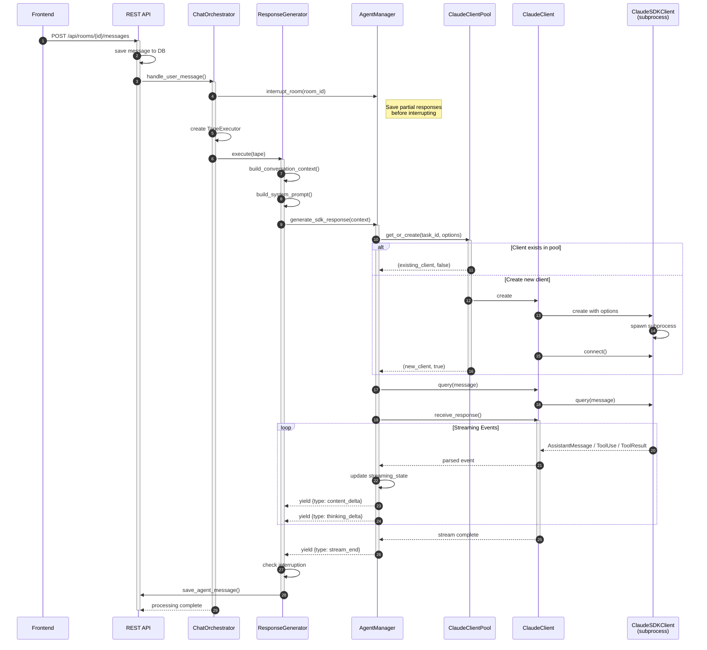
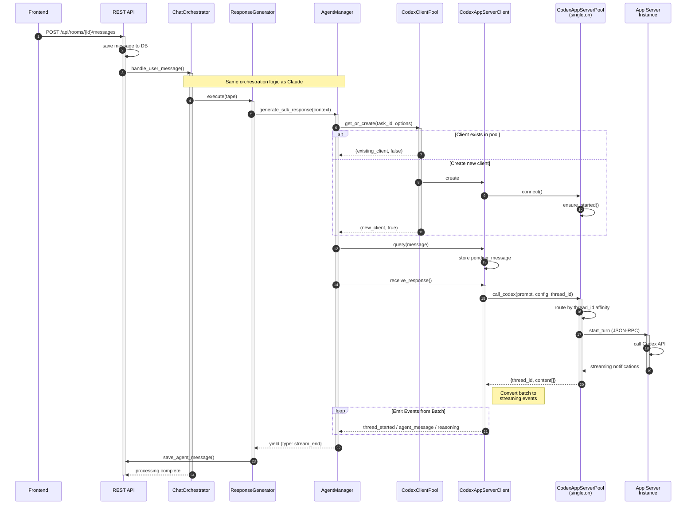
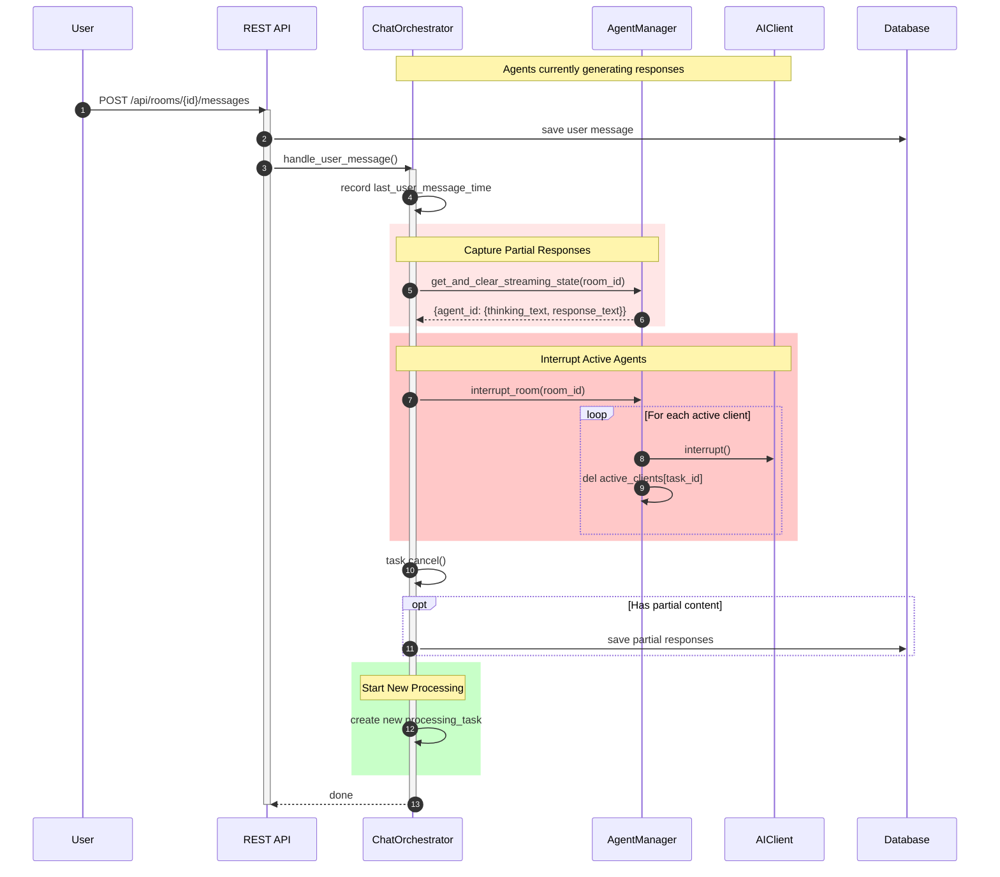
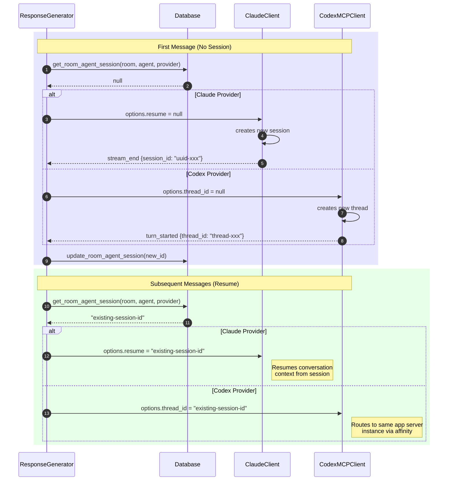

# Chat Orchestration Sequence Diagrams

This document describes the message flow for both Claude SDK and Codex providers.

## Overview

ChitChats supports two AI providers through a unified abstraction layer:

- **Claude SDK**: Uses Claude Agent SDK via Claude Code CLI (subprocess-based)
- **Codex**: Uses Codex via app server pool (persistent connections)

Both providers share the same orchestration logic but differ in their client implementations.

---

## Claude SDK Flow



---

## Codex App Server Flow



---

## Interruption Flow

When a new user message arrives while agents are processing:



---

## Session Persistence



---

## Provider Comparison

| Aspect | Claude SDK | Codex |
|--------|-----------|-------|
| **Connection** | Subprocess per client | Shared app server pool |
| **Streaming** | True streaming | JSON-RPC streaming notifications |
| **Session ID** | `options.resume` (UUID) | `thread_id` |
| **Pool Limit** | 10 concurrent | Configurable (default: 3) |
| **Server Mgmt** | Per-client subprocess | Singleton pool w/ instances |
| **Tool Capture** | PostToolUse hooks | Stream parsing |
| **Parallelism** | Multiple subprocesses | Multiple app server instances |

---

## Unified Event Types

Both providers emit the same event types for downstream processing:

```json
{"type": "stream_start", "temp_id": "temp_room1_agent1_abc123"}

{"type": "content_delta", "delta": "Hello, ", "temp_id": "..."}

{"type": "thinking_delta", "delta": "I should greet...", "temp_id": "..."}

{
  "type": "stream_end",
  "temp_id": "...",
  "response_text": "Hello, how are you?",
  "thinking_text": "I should greet the user warmly...",
  "session_id": "uuid-or-thread-id",
  "memory_entries": [],
  "anthropic_calls": [],
  "skipped": false
}
```

---

## Key Components

### Shared (Provider-Agnostic)

| Component | File |
|-----------|------|
| `ChatOrchestrator` | `backend/orchestration/orchestrator.py` |
| `ResponseGenerator` | `backend/orchestration/response_generator.py` |
| `AgentManager` | `backend/core/manager.py` |
| `AIClient` / `AIProvider` | `backend/providers/base.py` |

### Claude SDK Provider

| Component | File |
|-----------|------|
| `ClaudeProvider` | `backend/providers/claude/provider.py` |
| `ClaudeClient` | `backend/providers/claude/client.py` |
| `ClaudeClientPool` | `backend/providers/claude/pool.py` |
| `ClaudeStreamParser` | `backend/providers/claude/parser.py` |

### Codex Provider

| Component | File |
|-----------|------|
| `CodexProvider` | `backend/providers/codex/provider.py` |
| `CodexAppServerClient` | `backend/providers/codex/app_server_client.py` |
| `CodexClientPool` | `backend/providers/codex/pool.py` |
| `CodexAppServerPool` | `backend/providers/codex/app_server_pool.py` |
| `CodexAppServerInstance` | `backend/providers/codex/app_server_instance.py` |
| `CodexAppServerParser` | `backend/providers/codex/app_server_parser.py` |
