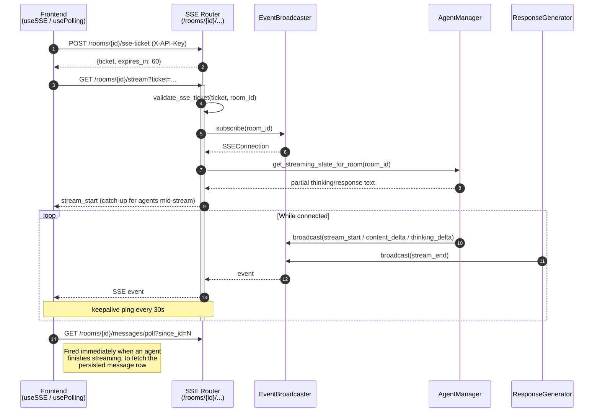
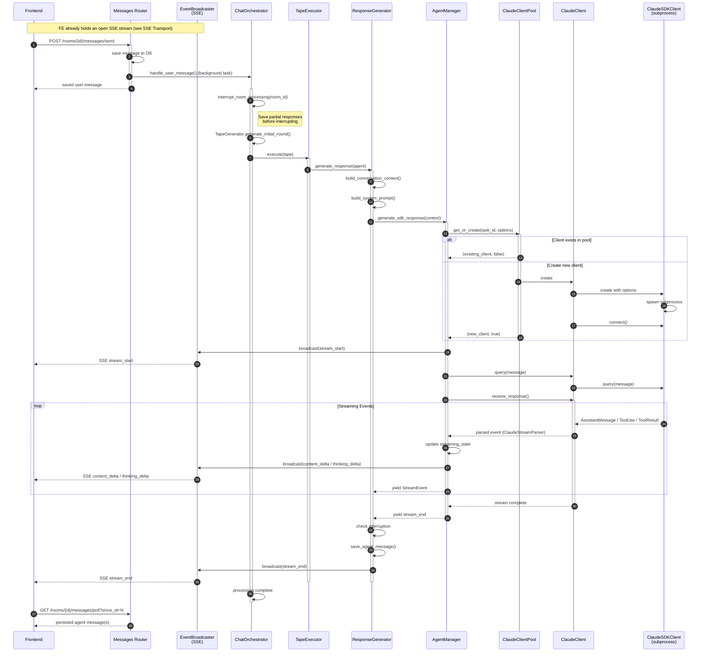
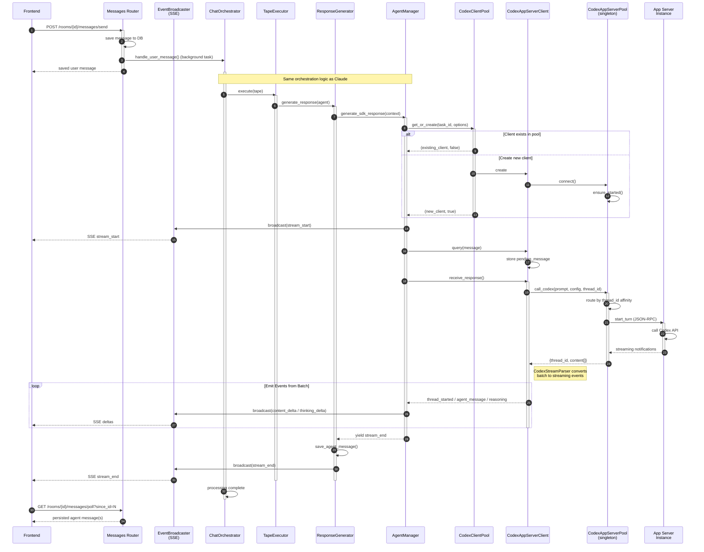
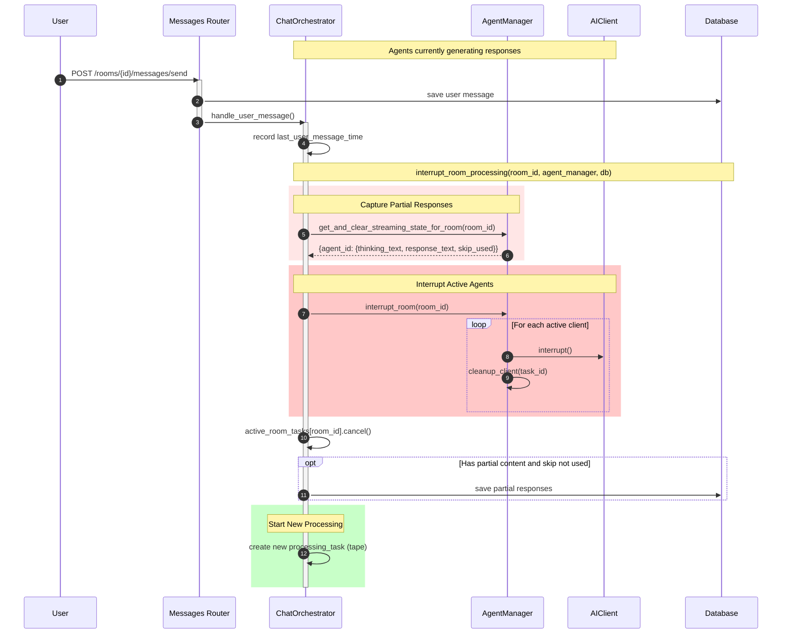
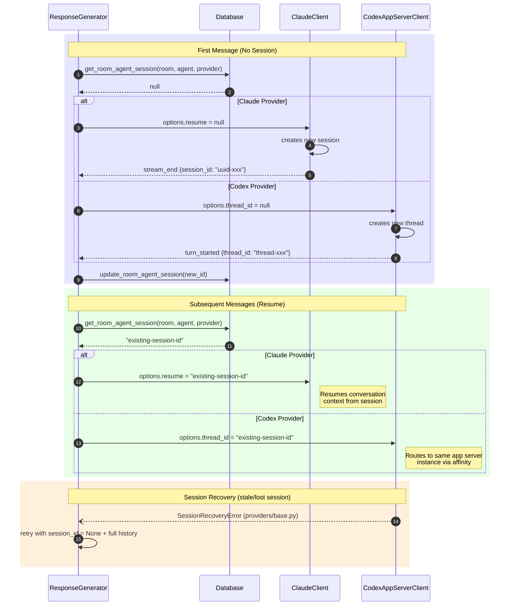

# Chat Orchestration Sequence Diagrams

This document describes the message flow for both Claude SDK and Codex providers.

## Overview

ChitChats supports two AI providers through a unified abstraction layer:

- **Claude SDK**: Uses Claude Agent SDK via Claude Code CLI (subprocess-based)
- **Codex**: Uses Codex via app server pool (persistent connections)

Both providers share the same orchestration logic but differ in their client implementations.

Real-time delivery to the browser is **Server-Sent Events (SSE)**: agent streaming events are pushed
from `EventBroadcaster` (`backend/core/sse.py`) over `GET /rooms/{id}/stream`
(`backend/routers/sse.py`). HTTP polling still exists, but only as a **fallback / persistence fetch**
(see [SSE Transport](#sse-transport)).

---

## SSE Transport

The frontend opens one SSE stream per room. Because `EventSource` cannot send custom headers, the
client first exchanges its JWT for a short-lived (60s), room-scoped ticket.


```mermaid
sequenceDiagram
    autonumber
    participant FE as Frontend<br/>(useSSE / usePolling)
    participant SSE as SSE Router<br/>(/rooms/{id}/...)
    participant EB as EventBroadcaster
    participant AM as AgentManager
    participant RG as ResponseGenerator

    FE->>SSE: POST /rooms/{id}/sse-ticket (X-API-Key)
    SSE-->>FE: {ticket, expires_in: 60}

    FE->>SSE: GET /rooms/{id}/stream?ticket=...
    activate SSE
    SSE->>SSE: validate_sse_ticket(ticket, room_id)
    SSE->>EB: subscribe(room_id)
    EB-->>SSE: SSEConnection
    SSE->>AM: get_streaming_state_for_room(room_id)
    AM-->>SSE: partial thinking/response text
    SSE-->>FE: stream_start (catch-up for agents mid-stream)

    loop While connected
        AM->>EB: broadcast(stream_start / content_delta / thinking_delta)
        RG->>EB: broadcast(stream_end)
        EB-->>SSE: event
        SSE-->>FE: SSE event
        Note over SSE,FE: keepalive ping every 30s
    end
    deactivate SSE

    FE->>SSE: GET /rooms/{id}/messages/poll?since_id=N
    Note right of FE: Fired immediately when an agent<br/>finishes streaming, to fetch the<br/>persisted message row
```

**Polling fallback** (`frontend/src/hooks/usePolling.ts`, which wraps `useSSE`):

- `GET /rooms/{id}/messages/poll?since_id=N` runs on a **5s** safety-net interval (and immediately on
  each `stream_end`) — persisted messages are always fetched over REST, never pushed as full rows.
- `GET /rooms/{id}/chatting-agents` is polled every **5s only while SSE is disconnected**; when SSE is
  connected, typing/thinking indicators come from the stream.
- `useSSE` reconnects with exponential backoff (1s → 30s, max 10 attempts).

---

## Claude SDK Flow


```mermaid
sequenceDiagram
    autonumber
    participant FE as Frontend
    participant API as Messages Router
    participant EB as EventBroadcaster<br/>(SSE)
    participant CO as ChatOrchestrator
    participant TE as TapeExecutor
    participant RG as ResponseGenerator
    participant AM as AgentManager
    participant Pool as ClaudeClientPool
    participant Client as ClaudeClient
    participant SDK as ClaudeSDKClient<br/>(subprocess)

    Note over FE,EB: FE already holds an open SSE stream (see SSE Transport)

    FE->>API: POST /rooms/{id}/messages/send
    activate API
    API->>API: save message to DB
    API->>CO: handle_user_message() (background task)
    API-->>FE: saved user message
    deactivate API
    activate CO

    CO->>CO: interrupt_room_processing(room_id)
    Note right of CO: Save partial responses<br/>before interrupting

    CO->>CO: TapeGenerator.generate_initial_round()
    CO->>TE: execute(tape)
    activate TE
    TE->>RG: generate_response(agent)
    activate RG

    RG->>RG: build_conversation_context()
    RG->>RG: build_system_prompt()
    RG->>AM: generate_sdk_response(context)
    activate AM

    AM->>Pool: get_or_create(task_id, options)
    activate Pool

    alt Client exists in pool
        Pool-->>AM: (existing_client, false)
    else Create new client
        Pool->>Client: create
        Client->>SDK: create with options
        SDK->>SDK: spawn subprocess
        Client->>SDK: connect()
        Pool-->>AM: (new_client, true)
    end
    deactivate Pool

    AM->>EB: broadcast(stream_start)
    EB-->>FE: SSE stream_start

    AM->>Client: query(message)
    Client->>SDK: query(message)

    AM->>Client: receive_response()
    activate Client

    loop Streaming Events
        SDK-->>Client: AssistantMessage / ToolUse / ToolResult
        Client-->>AM: parsed event (ClaudeStreamParser)
        AM->>AM: update streaming_state
        AM->>EB: broadcast(content_delta / thinking_delta)
        EB-->>FE: SSE content_delta / thinking_delta
        AM-->>RG: yield StreamEvent
    end

    Client-->>AM: stream complete
    deactivate Client

    AM-->>RG: yield stream_end
    deactivate AM

    RG->>RG: check interruption
    RG->>RG: save_agent_message()
    RG->>EB: broadcast(stream_end)
    EB-->>FE: SSE stream_end
    deactivate RG
    deactivate TE

    CO->>CO: processing complete
    deactivate CO

    FE->>API: GET /rooms/{id}/messages/poll?since_id=N
    API-->>FE: persisted agent message(s)
```

---

## Codex App Server Flow


```mermaid
sequenceDiagram
    autonumber
    participant FE as Frontend
    participant API as Messages Router
    participant EB as EventBroadcaster<br/>(SSE)
    participant CO as ChatOrchestrator
    participant TE as TapeExecutor
    participant RG as ResponseGenerator
    participant AM as AgentManager
    participant Pool as CodexClientPool
    participant Client as CodexAppServerClient
    participant SP as CodexAppServerPool<br/>(singleton)
    participant Server as App Server<br/>Instance

    FE->>API: POST /rooms/{id}/messages/send
    activate API
    API->>API: save message to DB
    API->>CO: handle_user_message() (background task)
    API-->>FE: saved user message
    deactivate API
    activate CO

    Note over CO,AM: Same orchestration logic as Claude

    CO->>TE: execute(tape)
    activate TE
    TE->>RG: generate_response(agent)
    activate RG

    RG->>AM: generate_sdk_response(context)
    activate AM

    AM->>Pool: get_or_create(task_id, options)
    activate Pool

    alt Client exists in pool
        Pool-->>AM: (existing_client, false)
    else Create new client
        Pool->>Client: create
        Client->>SP: connect()
        SP->>SP: ensure_started()
        Pool-->>AM: (new_client, true)
    end
    deactivate Pool

    AM->>EB: broadcast(stream_start)
    EB-->>FE: SSE stream_start

    AM->>Client: query(message)
    Client->>Client: store pending_message

    AM->>Client: receive_response()
    activate Client

    Client->>SP: call_codex(prompt, config, thread_id)
    activate SP

    SP->>SP: route by thread_id affinity
    SP->>Server: start_turn (JSON-RPC)
    activate Server
    Server->>Server: call Codex API
    Server-->>SP: streaming notifications
    deactivate Server

    SP-->>Client: {thread_id, content[]}
    deactivate SP

    Note right of Client: CodexStreamParser converts<br/>batch to streaming events

    loop Emit Events from Batch
        Client-->>AM: thread_started / agent_message / reasoning
        AM->>EB: broadcast(content_delta / thinking_delta)
        EB-->>FE: SSE deltas
    end
    deactivate Client

    AM-->>RG: yield stream_end
    deactivate AM

    RG->>RG: save_agent_message()
    RG->>EB: broadcast(stream_end)
    EB-->>FE: SSE stream_end
    deactivate RG
    deactivate TE

    CO->>CO: processing complete
    deactivate CO

    FE->>API: GET /rooms/{id}/messages/poll?since_id=N
    API-->>FE: persisted agent message(s)
```

---

## Interruption Flow

When a new user message arrives while agents are processing:


```mermaid
sequenceDiagram
    autonumber
    participant User
    participant API as Messages Router
    participant CO as ChatOrchestrator
    participant AM as AgentManager
    participant Client as AIClient
    participant DB as Database

    Note over CO,Client: Agents currently generating responses

    User->>API: POST /rooms/{id}/messages/send
    activate API

    API->>DB: save user message
    API->>CO: handle_user_message()
    deactivate API
    activate CO

    CO->>CO: record last_user_message_time

    Note over CO,DB: interrupt_room_processing(room_id, agent_manager, db)

    rect rgb(255, 230, 230)
        Note over CO,AM: Capture Partial Responses
        CO->>AM: get_and_clear_streaming_state_for_room(room_id)
        AM-->>CO: {agent_id: {thinking_text, response_text, skip_used}}
    end

    rect rgb(255, 200, 200)
        Note over CO,Client: Interrupt Active Agents
        CO->>AM: interrupt_room(room_id)
        loop For each active client
            AM->>Client: interrupt()
            AM->>AM: cleanup_client(task_id)
        end
    end

    CO->>CO: active_room_tasks[room_id].cancel()

    opt Has partial content and skip not used
        CO->>DB: save partial responses
    end

    rect rgb(200, 255, 200)
        Note over CO: Start New Processing
        CO->>CO: create new processing_task (tape)
    end

    deactivate CO
```

---

## Session Persistence


```mermaid
sequenceDiagram
    autonumber
    participant RG as ResponseGenerator
    participant DB as Database
    participant Claude as ClaudeClient
    participant Codex as CodexAppServerClient

    rect rgb(230, 230, 255)
        Note over RG,Codex: First Message (No Session)
        RG->>DB: get_room_agent_session(room, agent, provider)
        DB-->>RG: null

        alt Claude Provider
            RG->>Claude: options.resume = null
            Claude->>Claude: creates new session
            Claude-->>RG: stream_end {session_id: "uuid-xxx"}
        else Codex Provider
            RG->>Codex: options.thread_id = null
            Codex->>Codex: creates new thread
            Codex-->>RG: turn_started {thread_id: "thread-xxx"}
        end

        RG->>DB: update_room_agent_session(new_id)
    end

    rect rgb(230, 255, 230)
        Note over RG,Codex: Subsequent Messages (Resume)
        RG->>DB: get_room_agent_session(room, agent, provider)
        DB-->>RG: "existing-session-id"

        alt Claude Provider
            RG->>Claude: options.resume = "existing-session-id"
            Note right of Claude: Resumes conversation<br/>context from session
        else Codex Provider
            RG->>Codex: options.thread_id = "existing-session-id"
            Note right of Codex: Routes to same app server<br/>instance via affinity
        end
    end

    rect rgb(255, 240, 220)
        Note over RG,Codex: Session Recovery (stale/lost session)
        Codex--)RG: SessionRecoveryError (providers/base.py)
        RG->>RG: retry with session_id = None + full history
    end
```

---

## Provider Comparison

| Aspect | Claude SDK | Codex |
|--------|-----------|-------|
| **Connection** | Subprocess per client | Shared app server pool |
| **Streaming** | True streaming | JSON-RPC streaming notifications |
| **Session ID** | `options.resume` (UUID) | `thread_id` |
| **Pool Limit** | 10 concurrent connects (`BaseClientPool`) | `CODEX_MAX_INSTANCES` app servers (default: 10, LRU eviction) |
| **Server Mgmt** | Per-client subprocess | Singleton pool w/ per-agent instances |
| **Tool Capture** | PostToolUse hooks | Stream parsing |
| **Parallelism** | Multiple subprocesses | Multiple app server instances |

---

## Unified Event Types

Both providers emit the same event types for downstream processing:

```json
{"type": "stream_start", "temp_id": "temp_room1_agent1_abc123"}

{"type": "content_delta", "delta": "Hello, ", "temp_id": "..."}

{"type": "thinking_delta", "delta": "I should greet...", "temp_id": "..."}

{
  "type": "stream_end",
  "temp_id": "...",
  "response_text": "Hello, how are you?",
  "thinking_text": "I should greet the user warmly...",
  "session_id": "uuid-or-thread-id",
  "memory_entries": [],
  "anthropic_calls": [],
  "skipped": false
}
```

When these events are broadcast to SSE clients, `agent_id` is added for client-side routing
(and `stream_start` also carries `agent_name` / `agent_profile_pic`).

---

## Key Components

### Shared (Provider-Agnostic)

| Component | File |
|-----------|------|
| `ChatOrchestrator` | `backend/chatroom_orchestration/orchestrator.py` |
| `TapeGenerator` / `TapeExecutor` | `backend/chatroom_orchestration/tape/` |
| `build_conversation_context` | `backend/chatroom_orchestration/context.py` |
| `save_agent_message` | `backend/chatroom_orchestration/handlers.py` |
| `ResponseGenerator` | `backend/core/response_generator.py` |
| `AgentManager` | `backend/core/manager.py` |
| `EventBroadcaster` / `SSEConnection` | `backend/core/sse.py` |
| SSE + message routes | `backend/routers/sse.py`, `backend/routers/messages.py` |
| App/router wiring | `backend/core/app_factory.py` |
| `AIClient` / `AIProvider` / `SessionRecoveryError` | `backend/providers/base.py` |
| `BaseClientPool` | `backend/providers/base_pool.py` |
| `build_system_prompt` | `backend/providers/prompt_builder.py` |

### Claude SDK Provider

| Component | File |
|-----------|------|
| `ClaudeProvider` | `backend/providers/claude/provider.py` |
| `ClaudeClientPool` | `backend/providers/claude/provider.py` |
| `ClaudeClient` | `backend/providers/claude/client.py` |
| `ClaudeStreamParser` | `backend/providers/claude/parser.py` |

### Codex Provider

| Component | File |
|-----------|------|
| `CodexProvider` | `backend/providers/codex/provider.py` |
| `CodexClientPool` | `backend/providers/codex/provider.py` |
| `CodexAppServerClient` | `backend/providers/codex/app_server_client.py` |
| `CodexAppServerPool` | `backend/providers/codex/app_server_pool.py` |
| `CodexAppServerInstance` | `backend/providers/codex/app_server_instance.py` |
| `CodexStreamParser` | `backend/providers/codex/parser.py` |
| `ThreadSessionManager` | `backend/providers/codex/thread_manager.py` |
